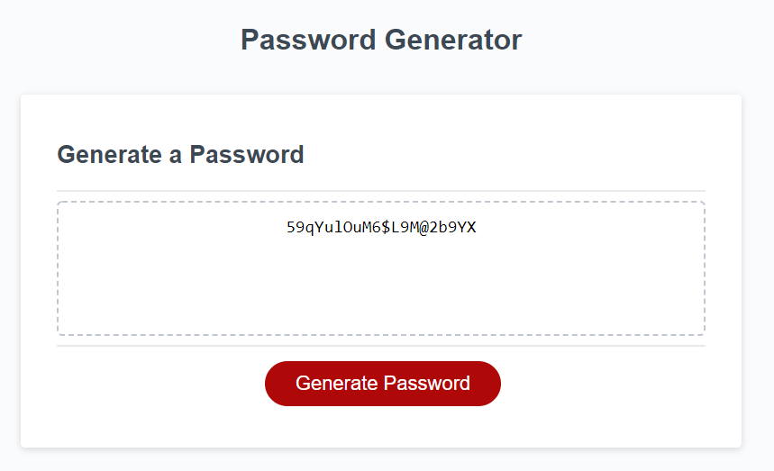

# Password Generator

Description
------------

This is a password generation program. It first prompts the user to input how many characters they would like their password to be, between 8 and 128. The program then uses four confirm messages to request which type of characters they would like. The four options are capial letters, lowercase letters, numbers, and special characters. The program will verify that at least one of the character types is selected in addition to making sure that the initial input is a number and in the specified range. The program will then randomly select characters to be input into password. There is also verification in place to ensure that at least one of each character type requested is present in the final password.

The site can be seen using the following URL: https://kjphelps90.github.io/password_generator/

Author(s)
------------

* HTML & CSS - Rutgers University

* Javascript - Kevin Phelps

Version history
------------

0.1 - Inital Release

Preview
------------

